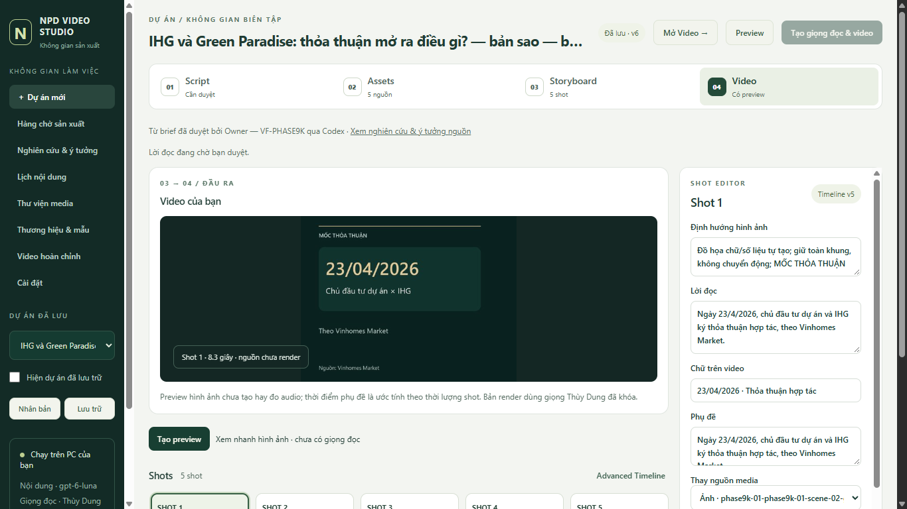

# Phase 10 — Production Intelligence and NPD Studio

The Phase10 implementation is available for human campaign testing at [Studio8030](http://127.0.0.1:8030/production). Technical verification passes. Phase10 readiness remains NO because the required real human campaign has not been performed or accepted. Phase8 INTERNAL_PRODUCTION_READY and Phase9 CONTENT_INTELLIGENCE_READY remain YES.

## Release and deployment

- Frozen accepted baseline: `4c4043cb8a6a559aeb9dae598fd0391045626b23`.
- Branch: `codex/vf-post-mvp-roadmap-execution-01`.
- Progressive commits: `62eda29` baseline/audit; `84b39f5` canonical shots and measured timing; `2d0b3a0` AI/preview/planning backend; `3e00cd989871e89065aacee8cc2498c801e081f2` verified Studio implementation. Final evidence HEAD is the commit containing this report and `milestone-04.md`, resolvable with `git log -1 --format=%H -- PHASE10_PRODUCTION_INTELLIGENCE_DRAMAGIC_STUDIO_REPORT.md`; a report cannot embed its own future Git object hash.
- Accepted live data: `C:/NPD-Video-Factory/phase2`; accepted service8026 was not interrupted or migrated by this task.
- Isolated Phase10 data: `C:/NPD-Video-Factory/phase10-uat`; service8030 uses the existing credential references and runtime. No new key, provider subscription, runtime dependency, publishing or autonomous scheduler was introduced.

The old8026 process still has its original Python modules loaded. A new-static/old-backend import incompatibility was found and corrected with capability-gated loading. Actual browser reloads of both Native and Content Intelligence now work on8026. A normal future planned restart is needed to load Phase10 backend code there; this report does not claim live8026 has already been upgraded. See [mixed-runtime evidence](evidence/post-mvp-roadmap/phase-10/mixed-runtime-compatibility.md).

## Architecture and implemented workflow

Script → Assets → Storyboard/Shots → Video is the default editor. Original project, source upload/analysis, brand/template, review, job, final-watch and download controls remain accessible. Selected-shot editing, horizontal cards, reorder/duplicate/delete/revert, asset replacement, existing-source regeneration, crop/trim/pan/zoom/transition, duration, subtitle and narration controls use the same persisted backend state.

Native now stores an opt-in canonical TimelineSnapshot1.1 in the existing project document. Stable shot IDs, timeline version and digest are updated atomically with the legacy proposal/media/edit-plan projections. GET derives old projects without writing a migration. Each explicit mutation appends history, checks the current revision and invalidates affected preview/approval. Render rejects divergent projections. Accepted historical job/timeline/video files remain immutable.

Scoped AI Edit uses the existing OpenAI connection, persists the original intent/context/provider/result/failure receipt and presents a proposal before explicit apply. A selected update can include dependent warm-voice and retiming shots; visual-only changes preserve voice reuse. The unchanged certified warm-cache recipe binds scene ordinal and preceding enabled narration, so reorder/insert/delete correctly identify affected dependencies. Ambiguous provider outcomes are not silently replayed. Suggestions are not verified research facts or generated media.

Preview is a version/digest/revision-bound silent visual proxy, with source/caption/template hashes, per-shot cache, progress, cancel and stale checks. Proxy captions use estimated scene timing and are labelled accordingly. Final render still requires explicit human action and current content/media approval. Canonical duration placement uses measured raw narration samples, retains rawvoice artifacts and never changes pitch or speaking speed; insufficient duration is an explicit failure. Tests execute the existing renderer for portrait and landscape output.

Production Intelligence adds a separate local planning store, without destructive Native or Content Intelligence schema migration. Its queue derives11 stages from existing idea/brief/script/storyboard/render/review records. Campaign/date/profile/brand/format/priority grouping is local planning. Published and fetched dates remain separate; unknown/stale/future publication dates are visible. Lexical similarity against titles/hooks/scripts/topics/videos provides warnings and a version-bound human override. Priority weights are configuration and clearly heuristic, not predicted views/leads.

Five configured profiles include Green Paradise, Saigon Park, Vang Nguyễn, Vietnam property and infrastructure. Brand/template selection reuses configured NPD/Vang abstractions with9:16/16:9 and30/45/60s variants. Missing official artwork is not invented. Explicit multi-select script/storyboard batches retain per-item failures/idempotent receipts and script/media/video gates. The historical approved-video library validates artifact/checkpoint hashes, human acceptance and available timeline schema/digest, and exposes Research → Idea → Brief → Script → Storyboard → Timeline → Render lineage.

## Verification and practical preparation

| Verification | Result and boundary |
|---|---|
| Full Native regression |226/226 PASS,99.966s; [log](evidence/post-mvp-roadmap/phase-10/final-native-regression.log) |
| Full Studio regression |54/54 PASS; [log](evidence/post-mvp-roadmap/phase-10/final-studio-regression.log) |
| HTTP/session/security |10 isolated real HTTP tests, including capability/cookie/CSRF, stale/busy/archive boundaries, range serving, failure persistence and restart; providers deliberately labelled fixtures |
| FFmpeg/render/audio |Actual synthetic-PCM portrait/landscape render, measured timing, subtitles, cache/cancel/concurrency and overflow failure tests; not new live TTS/ASR acceptance |
| Actual OpenAI |Two actual scoped suggestions in an unapproved technical clone; explicit browser apply for one; no TTS/render dispatch, no automatic retry |
| Browser shot operations |Narration, asset, duration, reorder, local-source regeneration and AI apply saved at project revision6/timelinev5; actual540x960 proxy readyState4 |
| Preview reuse |After the AI edit, four proxies reused and one rebuilt; restart preserved current timeline and READY preview |
| Accepted data preservation |Live workflow/intelligence table digests unchanged; all1,596 prior evidence files and15 accepted MP4 hashes unchanged; runtime dependencies unchanged |
| Historical usability |Old accepted Phase8 project opens in new UAT Studio with combined approval preserved; final1080x1920 video loaded; library15/15 |
| Campaign preparation |10 retained research forks/50 actual prior candidates and five unapproved practice copies; Codex preparation is not human selection or acceptance |
| Responsive verification |1366/1920 visual and DOM checks;2560 DOM geometry passes, full bitmap capture unverified because IAB returned scaled/tiled pixels |

Evidence: [technical browser receipt](evidence/post-mvp-roadmap/phase-10/technical-browser-receipt.json), [preservation receipt](evidence/post-mvp-roadmap/phase-10/final-preservation-verification.json), [UAT preparation](evidence/post-mvp-roadmap/phase-10/uat-preparation.json), [viewport receipt](evidence/post-mvp-roadmap/phase-10/viewport-verification.json). Actual TTS/ASR calls were not repeated during Phase10. Certified raw voices/final videos and relevant regression tests are preserved; the human campaign must evaluate new final audio/video.

## Screenshots

Additional captures: [1920 preview](evidence/post-mvp-roadmap/phase-10/screenshots/studio-preview-1920x1080.jpg), [Assets](evidence/post-mvp-roadmap/phase-10/screenshots/assets-1920x1080.jpg), [Production Queue](evidence/post-mvp-roadmap/phase-10/screenshots/production-queue-1920x1080.jpg), [source type and dates](evidence/post-mvp-roadmap/phase-10/screenshots/source-dates-and-type.jpg), [profiles](evidence/post-mvp-roadmap/phase-10/screenshots/content-profiles.jpg), [final lineage](evidence/post-mvp-roadmap/phase-10/screenshots/final-video-lineage.jpg), [live compatibility](evidence/post-mvp-roadmap/phase-10/screenshots/main-8026-legacy-compatible.jpg). The two2560 diagnostic captures are not acceptance screenshots.

## Acceptance gate

| Gate | Current result |
|---|---|
|1. Production Queue |Technical PASS; human campaign pending |
|2. Script/Assets/Storyboard/Video |Technical PASS; human campaign pending |
|3. Shot Studio |Technical PASS |
|4. Canonical timeline preserved |Technical PASS; original Docker editor retained separately, no shared-storage claim |
|5. Restart persistence |PASS on the isolated technical clone |
|6. Replace Asset |Technical PASS; required human action pending |
|7. Regenerate Shot |Technical PASS for alternate existing local source; required human action pending |
|8. Narration edit |Technical PASS; required human action pending |
|9. Duration edit |Technical PASS; required human action pending |
|10. Reorder |Technical PASS; required human action pending |
|11. Preview version/invalidation |Technical PASS |
|12. Final render |Technical FFmpeg tests PASS; new campaign final rendering/watch acceptance pending |
|13. Phase8 regression |PASS for tests, accepted artifacts/data and old project browser access; no new provider acceptance claim |
|14. Phase9 regression |PASS for tests, accepted artifacts/data and original CI browser access |
|15. Old projects open |PASS, with immutable historical approvals preserved |
|16. Human real campaign |PENDING; not performed by the Owner |

## Limits and required next action

Advanced Timeline is a canonical track/clip navigator into the same shot editor, not free multitrack or clip-drag editing. The separate pre-existing Docker editor is untouched and does not edit Native's project database. Regenerate Shot selects an alternate existing project source; it does not create a new image/video. AI Edit proposes text/duration/available-asset changes, not AI media synthesis; trim, crop, motion and transition use manual shot controls. Voice remains the certified Thùy Dung preset. Undo/redo is not invented; explicit history/revert is available. Preview remains silent; final audio is measured and reviewed in the existing production flow.

Human campaign acceptance and complete2560 visual verification remain outstanding. The prepared [campaign guide](evidence/post-mvp-roadmap/phase-10/PHASE10_UAT_GUIDE.md) contains actual links for selecting10 ideas and prioritizing/producing at least5, the five required human shot actions, version/cache checks, explicit final render and full watch/listen decisions. Practice copies and Codex technical actions do not satisfy this gate. The pending human question requests the operator name, selected cases/projects, action records and final decisions.

Next recommendation: finish that campaign in8030, reconcile real persisted human reviews and final artifact hashes, fix any observed defect, then reconsider the readiness gates. Do not start autonomous publishing, analytics learning or distributed orchestration.

PRODUCTION_INTELLIGENCE_READY = NO

DRAMAGIC_STUDIO_READY = NO

PHASE10_READY = NO
